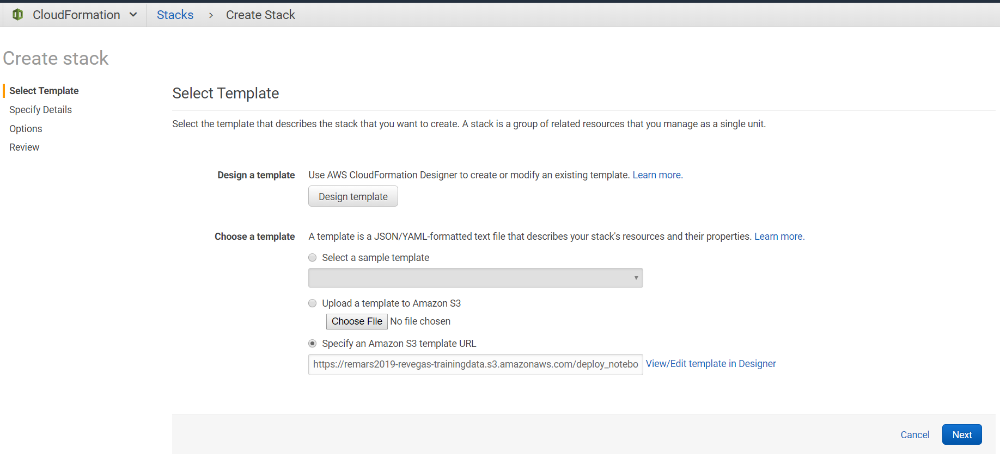
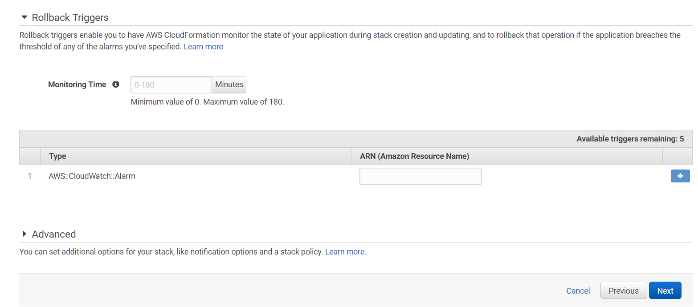
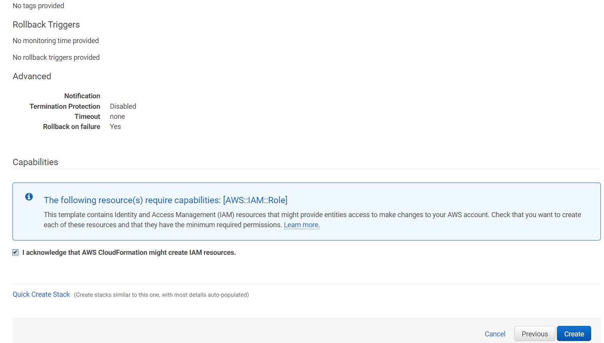
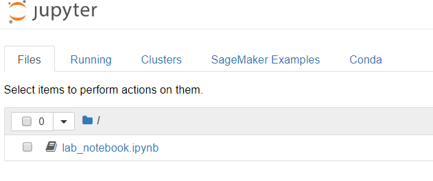
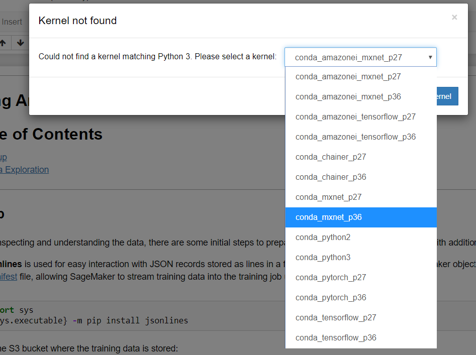

# Lab Guide: AI/ML Blackjack Challenge 

## Table of Contents

1. Introduction
2. Create a SageMaker role and policy
3. Setup your SageMaker notebook
4. Detecting playing cards using Amazon SageMaker's built-in object detection

### Important Note: For the duration of this lab, be sure to select the US East (N. Virginia) AWS Region:

.png)

### Introduction

In this workshop, you will learn how to use machine learning and computer vision to detection the rank and suit of playing cards from a [Standard 52-card deck](https://en.wikipedia.org/wiki/Standard_52-card_deck). We'll use cloud services from AWS to develop, train, and deploy for prediction a deep neural network model.

Object detection is the process of identifying and localizing objects in an image. A typical object detection solution takes an image as input and provides a bounding box on the image where an object of interest is found. It also identifies what type of object the box encapsulates. To create such a solution, we need to acquire and process a training dataset, create and setup a training job for the algorithm so that it can learn about the dataset. Finally, we can then host the trained model in an endpoint, to which we can supply images.

We provide a training set of 5,000 images of playing cards in Amazon S3 that are synthetically displayed with different backgrounds, rotation, zoom, and other image augmentation techniques. This notebook is an end-to-end example showing how the Amazon SageMaker Object Detection algorithm can be used such playing card images to detect playing cards on a blackjack table. Amazon SageMaker's object detection algorithm uses the Single Shot multibox Detector [(SSD)](https://arxiv.org/abs/1512.02325) algorithm, and this notebook uses a [ResNet](https://arxiv.org/pdf/1603.05027.pdf) base network with that algorithm.

### Initiate the lab

Amazon SageMaker is a fully-managed service that covers the entire machine learning workflow to label and prepare your data, choose an algorithm, train the model, tune and optimize it for deployment, make predictions, and take action. For this workshop, we'll use Notebooks in Amazon SageMaker to design, build, and train our model.

We will use an AWS CloudFormation Template to automate the deployment of the Amazon SageMaker Notebook Instance, IAM Roles, and IAM Policies to streamline the lab. Before clicking the Launch Stack button, be sure you have logged into the AWS Management Console via Event Engine:

Accept the defaults and click next:

Enter a new stack name or leave the default:

On the third screen, accept the defaults and click Next:

On the last screen, verify the template, and check the box next to the statement, "I acknowledge that AWS CloudFormation might create IAM resources".

The template should take around 4-5 minutes to complete.

### Start the machine learning lab

Follow the below link to open the Amazon SageMaker Notebook Instance in your browser:

[Open your SageMaker Notebook Instance](https://console.aws.amazon.com/sagemaker/home?region=us-east-1#/notebook-instances/openNotebook/BlackjackNotebookInstance?view=classic)

In the Jupyter page, open the notebook file we preloaded for you by clicking on **lab_notebook.ipynb**

Select the kernel as below:

Finally, click on **Not Trusted** and then click **Trust** to trust the notebook.

You are now ready to run through each Jupyter cell!